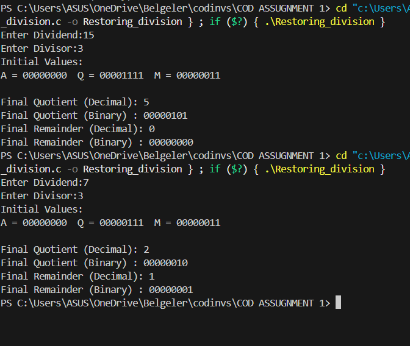

# IS2101-ArithmeticOps--NNM24IS190-
To implement signed integer multiplication and division algorithms using C programming

This repository contains C programs implementing three fundamental arithmetic algorithms:  

1. **Sequential (Shift-Add) Multiplication**  
   - Supports signed integers using 2’s complement.  
   - Shows step-by-step shift and add logic.  

2. **Restoring Division Algorithm**  
   - Works with positive integers.  

3. **Non-Restoring Division Algorithm**  
   - Similar to restoring division but with non-restoring logic.  
   - Trace output of each step (accumulator,dividend,quotient bits). 

   These programs simulate how arithmetic operations are performed at the hardware level.
   It lets you get handson experience on how hardware level calculation work and how you can improvise the time complexity by minimizing the steps (for ex: restoring to non restoring division algorithm).

   ## File Structure
- `ShiftAddMultiplication.c` – Implements sequential multiplication  
- `RestoringDivision.c` – Implements restoring division  
- `Non_Restoring_Algorithm.c` – Implements non-restoring division  
- `README.md` – Project description and instructions

FOR COMPILETION:
```bash
gcc ShiftAddMultiplication.c -o ShiftAddMultiplication
./ShiftAddMultiplication

gcc RestoringDivision.c -o RestoringDivision
./RestoringDivision

gcc Non_Restoring_Algorithm.c -o NonRestoring
./NonRestoring
```
## Output of Shift-Add Multiplication


## Output of Restoring Division


## Output of Non-Restoring Division

